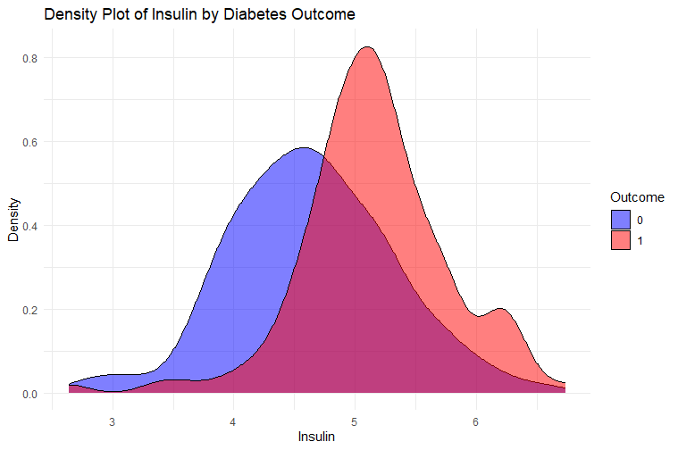
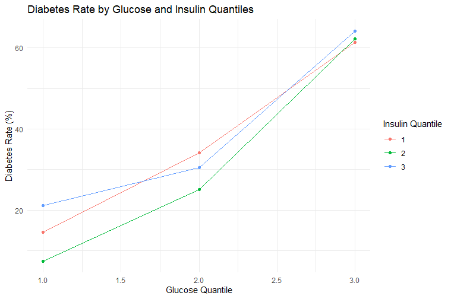

#Introduction
The goal of this repository is to find which biomarker causes the greatest increase in diabetes risk.
The diabetes data set contains data like; pregnancies, glucose, bloodpressure, skinthickness, insulin, BMI, age, and whether or not they have diabetes. 
We will graph insulin levels and glucose levels to see which biomarker has the greatest effect on the body, and its effects on diabetes risk.

#Implementation
We graphed insulin and glucose to see which biomarker is responsible for an increased risk of diabetes. We graphed them using ggplot2's density plot. An example can be seen below.

#Conclusion:
After running our visualizations we found that that glucose significantly increased the rate of diabetes in every insulin quantile. 
And so we can say that glucose is the biomarker which causes the greatest increase in diabetes risk. 
Below is the graph that explains the conclusion.

#Contact
Please send any inquiries to [ssb5642\@psu.edu](mailto:ssb5642@psu.edu). Thank you for your time!
